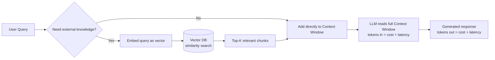
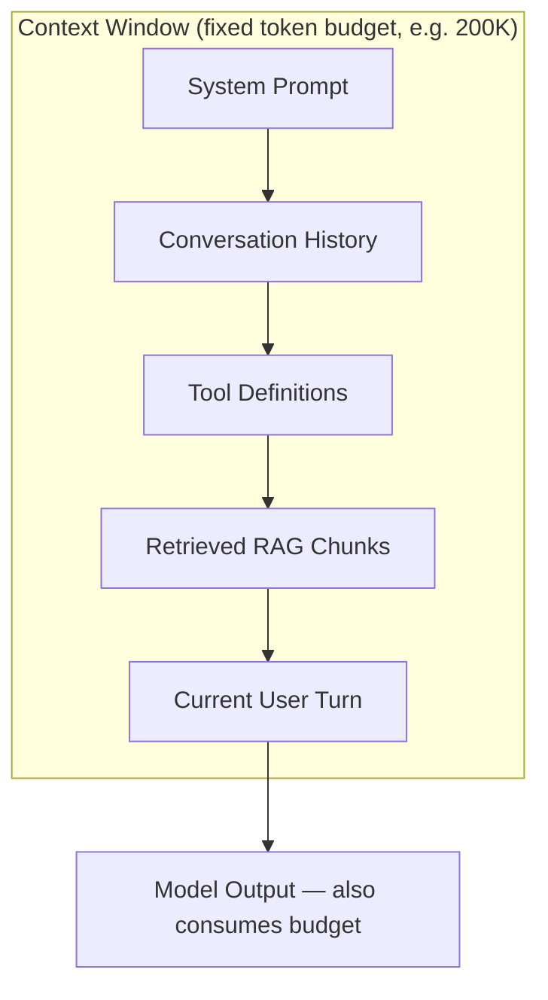

# 01 · LLM Fundamentals

*Prerequisite for everything else in this repo. If you already understand tokens, context windows, and embeddings well, skip to [03 · Agent Fundamentals](03-agent-fundamentals.md).*

## 1. Plain-Language Explanation

A large language model (LLM) doesn't read words — it reads **tokens**, chunks of text (roughly ¾ of a word in English) mapped to numbers. It doesn't have memory between requests — everything it "knows" about your conversation is re-sent as text in the **context window** on every single call. And it doesn't retrieve facts from a database by default — if you want it grounded in your own data, you either put that data in the context window directly, or use **embeddings** to search for the most relevant chunks and inject those (this is RAG — Retrieval-Augmented Generation).

These three ideas — tokens, context windows, and embeddings/RAG — are the physics of everything an agent does. An agent "forgetting" something, running out of budget, hallucinating, or acting slow/expensive almost always traces back to one of these three.

## 2. Why It Matters

Every agent problem you'll debug eventually reduces to one of:
- **"The agent forgot X"** → context window overflow or poor memory-summarization strategy
- **"The agent hallucinated a fact"** → no retrieval grounding, or retrieval returned irrelevant chunks
- **"The agent is slow / expensive"** → context bloat from unmanaged conversation/tool-result history
- **"The agent behaved inconsistently"** → generation parameters (temperature, top-p) not tuned for a deterministic task

You cannot design agent memory (Ch. 05) or evaluate RAG agents (Ch. 09) without understanding this chapter first.

## 3. Mental Model

Think of the context window as a **whiteboard with a fixed size**, not a filing cabinet. Every API call, the model re-reads the entire whiteboard from scratch — it has zero memory of anything erased or never written down. Tokens are the "words" you're allowed to write on that whiteboard, and you're billed per word, both for what you write (input) and what the model writes back (output). RAG is the practice of keeping a filing cabinet (vector database) next to the whiteboard, and copying only the most relevant pages onto the whiteboard just before asking your question.

## 4. Diagram





## 5. Official Documentation

- [Anthropic — Context Windows](https://platform.claude.com/docs) — how Claude models handle context, prompt caching
- [OpenAI — Models & Context Length Reference](https://platform.openai.com/docs/models)
- [OpenAI API Reference — generation parameters](https://platform.openai.com/docs/api-reference/chat/create) (temperature, top_p, frequency/presence penalty)
- [Google — Gemini Long Context Docs](https://ai.google.dev/gemini-api/docs/long-context)

## 6. High-Quality Secondary Resources

- [Tokens and Context Windows in LLMs — GeeksforGeeks](https://www.geeksforgeeks.org/artificial-intelligence/tokens-and-context-windows-in-llms/) — clean technical walkthrough
- [Understanding LLM Context Windows — Medium](https://medium.com/@tahirbalarabe2/understanding-llm-context-windows-tokens-attention-and-challenges-c98e140f174d) — good treatment of the "lost in the middle" effect
- [LLM Context Windows: Basics, Examples & Prompting Tips — Redis Engineering Blog](https://redis.io/blog/llm-context-windows/) — practical, includes benchmark data
- [What is RAG? — IBM Think](https://www.ibm.com/think/topics/retrieval-augmented-generation) — best conceptual breakdown of chunk/embed/retrieve/augment/generate
- [What is RAG? — AWS](https://aws.amazon.com/what-is/retrieval-augmented-generation/) — practitioner-oriented with clear diagrams

## 7. Seminal Papers

| Paper | Contribution |
|---|---|
| [Attention Is All You Need (Vaswani et al., 2017)](https://arxiv.org/abs/1706.03762) | Introduced the Transformer architecture underlying all modern LLMs |
| [Lost in the Middle: How Language Models Use Long Contexts (Liu et al., 2023)](https://arxiv.org/abs/2307.03172) | Empirically shows models attend better to the start/end of context than the middle — directly informs how to structure agent prompts |
| [Retrieval-Augmented Generation for Knowledge-Intensive NLP Tasks (Lewis et al., 2020)](https://arxiv.org/abs/2005.11401) | The original RAG paper |

## 8. Implementation Example

Minimal tokenization + context budgeting check before an API call (Python, using `tiktoken` for OpenAI-family tokenization):

```python
import tiktoken

def count_tokens(text: str, model: str = "gpt-4o") -> int:
    enc = tiktoken.encoding_for_model(model)
    return len(enc.encode(text))

def fits_context_window(system_prompt: str, history: list[str], 
                          max_context: int = 128_000, 
                          reserved_for_output: int = 4_000) -> bool:
    total = count_tokens(system_prompt)
    total += sum(count_tokens(turn) for turn in history)
    budget = max_context - reserved_for_output
    return total <= budget
```

A minimal RAG retrieval step before augmenting the prompt:

```python
# pseudo-code — works with any vector DB client (Chroma, Pinecone, pgvector, etc.)
query_embedding = embed(user_query)
top_chunks = vector_db.similarity_search(query_embedding, k=5)
augmented_prompt = f"""Context:
{format_chunks(top_chunks)}

Question: {user_query}"""
```

## 9. Common Mistakes & Debugging

- **Stuffing the entire conversation history into every call** instead of summarizing or pruning — silently balloons cost and latency, and degrades quality once you cross the "lost in the middle" threshold.
- **Assuming more context = better answers.** A 200K context window doesn't mean you should fill it. Irrelevant retrieved chunks actively hurt answer quality (they're noise the model has to filter).
- **Confusing tokens with words or characters.** Budgeting in characters will silently break at scale — always measure with the actual tokenizer for the model you're using.
- **Ignoring `max_tokens` on output** — a truncated JSON tool-call response is a classic source of "my agent randomly breaks" bugs.
- **Using default temperature (often 0.7–1.0) for deterministic tasks** like tool-argument generation or classification — set temperature near 0 for these.

**Debugging checklist when an agent "forgets" or hallucinates:**
1. Log the *exact* final prompt sent to the model (not what you think you sent).
2. Count tokens — are you near/over budget, causing silent truncation?
3. If RAG-grounded, log the retrieved chunks — are they actually relevant?
4. Check where in the context the critical info sits — start/end is safer than middle.

## 10. Production Best Practices

- Use **prompt caching** (supported by Anthropic and OpenAI) for static system prompts/tool definitions to cut cost and latency on repeated calls.
- Implement **context compression**: summarize old conversation turns instead of keeping raw history once you approach ~50% of budget.
- **Chunk RAG documents thoughtfully** — chunk size and overlap materially affect retrieval quality; this needs its own tuning pass, not defaults.
- Set `max_tokens` explicitly and handle the `stop_reason == "max_tokens"` case (don't assume a response finished).
- Track token usage per request in your observability layer (see [Ch. 10](10-observability.md)) — token drift is often the earliest signal of a regression.

## 11. Security Considerations

- Context windows are a **shared trust boundary** — anything placed in context (retrieved documents, tool outputs, user input) is read by the model with equal authority to your system prompt unless you architecturally separate it. This is the root cause of prompt injection (see [Ch. 11](11-security.md)).
- Never put secrets (API keys, credentials) in a prompt that later gets logged for observability — token-level logs often get less access control than application logs.

## 12. Exercises & Project Ideas

1. Write a function that truncates conversation history to fit a token budget, preserving the system prompt and the most recent N turns.
2. Build a tiny RAG pipeline over 10 of your own text files using any free vector DB (e.g. Chroma) and compare answer quality with vs. without retrieval.
3. Reproduce the "lost in the middle" effect: place a fact at the start, middle, and end of a long context and measure retrieval accuracy at each position.

## 13. Interview Questions

- What's the difference between a token and a word? Why does this matter for cost estimation?
- Explain the trade-off between context window size and retrieval quality in a RAG system.
- Why might increasing `temperature` hurt a tool-calling agent's reliability?
- What is "lost in the middle" and how would you architect prompts to mitigate it?

## 14. Related Concepts & Further Reading

- Next: [02 · Prompt Engineering](02-prompt-engineering.md)
- Related: [05 · Agent Memory](05-agent-memory.md) (memory is context-window management over multiple turns)
- Related: [09 · Evaluation & Testing](09-evaluation-testing.md) (RAG-specific metrics like faithfulness and retrieval precision)
