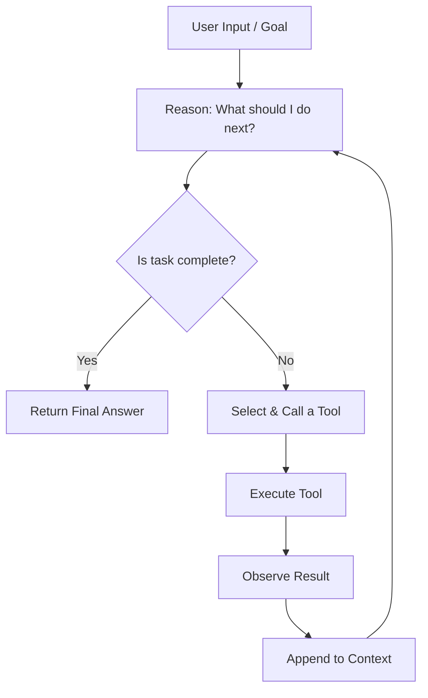
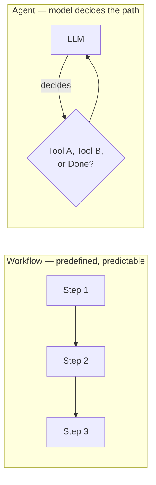

# 03 · Agent Fundamentals & The Agent Loop

## 1. Plain-Language Explanation

An **AI agent** is an LLM given three things a plain chatbot doesn't have: **tools** it can call, **memory/state** across steps, and **autonomy** to decide *which* tool to call and *when it's done* — rather than producing one fixed response. The core mechanism is the **agent loop**: perceive input → reason about what to do → act by calling a tool → observe the result → repeat until the goal is satisfied or a stopping condition is hit.

Critically: **not every LLM application needs to be an agent.** Anthropic draws a sharp, useful line here — a *workflow* is a predefined sequence of LLM/tool calls (predictable, easy to debug); an *agent* is a loop where the model itself decides the next step (flexible, harder to control). Most production systems are workflows with a small agentic component, not fully autonomous agents.

## 2. Why It Matters

This is the conceptual foundation for the entire rest of the repo. Every architecture in [Ch. 06](06-agent-architectures.md) (ReAct, Plan-and-Execute, ToT) is a specific *shape* of this loop. Every framework in [Ch. 08](08-building-agents-frameworks.md) is essentially an opinionated implementation of it. Getting this model right early prevents the most common beginner mistake: reaching for a fully autonomous agent when a simple deterministic workflow would be more reliable, cheaper, and easier to debug.

## 3. Mental Model

Think of an agent as a **new employee with a phone and a task list, but no memory of yesterday**. Each turn, you hand them a fresh briefing (the context window: system prompt + everything relevant so far) and they decide: "Do I have enough to answer, or do I need to make a call (tool use) first?" They make the call, read back what they learned, and re-decide. The loop ends when they either produce a final answer or a supervisor (you) cuts them off (max iterations, timeout, budget).

## 4. Diagram





## 5. Official Documentation

- [Anthropic — Building Effective Agents](https://www.anthropic.com/engineering/building-effective-agents) — the primary source for the workflow-vs-agent distinction used above
- [OpenAI — Agents SDK: Overview](https://developers.openai.com/api/docs/guides/agents)
- [Google ADK — Agent Concepts](https://google.github.io/adk-docs/)

## 6. High-Quality Secondary Resources

- [Hugging Face Agents Course, Unit 1 — What are Agents?](https://huggingface.co/learn/agents-course/unit1/introduction)
- [Every AI Agent Architecture in One Place — Towards AI (Medium)](https://pub.towardsai.net/every-ai-agent-architecture-in-one-place-595ba68d49cd)

## 7. Seminal Papers

| Paper | Contribution |
|---|---|
| [ReAct: Synergizing Reasoning and Acting in Language Models (Yao et al., 2023)](https://arxiv.org/abs/2210.03629) | Formalized the reason↔act interleaved loop that underlies most modern agents — see [Ch. 06](06-agent-architectures.md) |
| [Toolformer: Language Models Can Teach Themselves to Use Tools (Schick et al., 2023)](https://arxiv.org/abs/2302.04761) | Early demonstration that LLMs can learn *when* to invoke a tool, not just *how* |
| [ReWOO: Decoupling Reasoning from Observations (Xu et al., 2023)](https://arxiv.org/abs/2305.18323) | Argues for planning all steps up-front rather than interleaving — informs the workflow-vs-agent trade-off |

## 8. Implementation Example

A minimal hand-rolled agent loop (provider-agnostic pseudocode, concretely runnable against the OpenAI or Anthropic APIs by swapping the `call_model` function):

```python
def run_agent(goal: str, tools: dict, max_steps: int = 8) -> str:
    messages = [{"role": "user", "content": goal}]

    for step in range(max_steps):
        response = call_model(messages, tools=list(tools.values()))

        if response.stop_reason == "end_turn":
            return response.text  # agent decided it's done

        # Model wants to call a tool
        tool_call = response.tool_call
        tool_fn = tools[tool_call.name]["fn"]
        result = tool_fn(**tool_call.arguments)

        messages.append(response.to_message())
        messages.append({
            "role": "tool",
            "tool_call_id": tool_call.id,
            "content": str(result),
        })

    raise RuntimeError("Agent exceeded max_steps without finishing")
```

Note the two hard stopping conditions every real implementation needs: an explicit "done" signal from the model, and a `max_steps` ceiling as a circuit breaker.

## 9. Common Mistakes & Debugging

- **No step limit** — an agent stuck in a reasoning loop (e.g., repeatedly calling the same failing tool) will burn tokens indefinitely without one.
- **Reaching for an agent when a workflow would do.** If the sequence of steps is knowable in advance, hardcode it — it's more reliable and far cheaper to debug than letting the model rediscover the same plan every run.
- **Not logging intermediate steps.** When an agent gives a wrong final answer, you need the full trace (every tool call + result) to find where it went wrong — see [Ch. 10](10-observability.md).
- **Silently swallowing tool errors.** If a tool call fails, the agent needs the error fed back into context so it can adapt — not a generic "something went wrong."

## 10. Production Best Practices

- Always set a **max iteration / max token budget** circuit breaker, independent of the model's own judgment of "done."
- Prefer the **simplest architecture that solves the problem** — start with a workflow, escalate to an agent only when the task genuinely requires dynamic, unpredictable tool selection.
- Version and test your system prompt like code — small wording changes measurably shift tool-selection behavior.
- Separate the **planning/reasoning step** from the **execution step** in logs, so failures are attributable to "bad plan" vs. "bad execution."

## 11. Security Considerations

- Every tool an agent can call is a capability you're granting it — treat the tool list as a permission surface (principle of least privilege). See [Ch. 11](11-security.md).
- An agent loop that reads external content (web pages, emails, tool outputs) into context is exposed to prompt injection through that content — the loop has no inherent way to distinguish "instructions from the user" from "instructions embedded in a webpage it just read."

## 12. Exercises & Project Ideas

1. Implement the agent loop above against a real API with two tools (e.g., a calculator and a weather lookup) and a hard 5-step limit.
2. Convert a fixed 3-step workflow (e.g., fetch → summarize → email) into an agent and compare reliability across 20 runs — which is more consistent?
3. Add structured logging of every loop iteration (tool called, arguments, result, elapsed time) and visualize one run as a Mermaid sequence diagram.

## 13. Interview Questions

- What's the difference between a workflow and an agent, and when would you choose one over the other?
- Why does every production agent loop need a hard step/iteration limit?
- How would you debug an agent that produces a correct final answer only 60% of the time?
- What information does a tool result need to include for the agent to recover gracefully from a failure?

## 14. Related Concepts & Further Reading

- Previous: [02 · Prompt Engineering](02-prompt-engineering.md)
- Next: [04 · Tools & Function Calling](04-tools-function-calling.md)
- Deep dive: [06 · Agent Architectures](06-agent-architectures.md) — ReAct, Plan-and-Execute, ToT are all specific shapes of this loop
