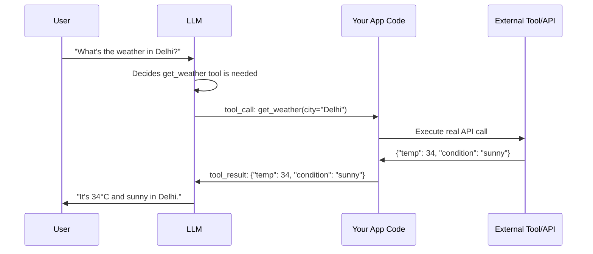

# 04 · Tools & Function Calling

## 1. Plain-Language Explanation

**Function calling** (a.k.a. tool use) is the mechanism that lets an LLM go from "text in, text out" to actually *doing things* — searching the web, querying a database, sending an email, running code. You give the model a list of tool **definitions** (name, description, and a JSON Schema of expected inputs). The model doesn't execute anything itself — it outputs a structured request ("call `get_weather` with `{"city": "Delhi"}`"). Your code executes the real function and feeds the result back into the conversation.

The model is choosing from a menu you wrote, not inventing capabilities — a tool it wasn't given, it cannot call, no matter how well the prompt is worded.

## 2. Why It Matters

Tools are what separate an agent from a chatbot. The quality of your tool *definitions* — names, descriptions, schemas — has an outsized effect on reliability; a poorly described tool gets called with wrong arguments or not called when it should be, far more often than model capability is the bottleneck. This is one of the highest-leverage things to get right in agent engineering.

## 3. Mental Model

A tool definition is like a **well-written API endpoint for a very literal new hire**: if the description is ambiguous, they'll misuse it exactly the way you'd expect a human to who's never seen your codebase and can't ask a clarifying question mid-call. The JSON Schema is a contract — the model fills it in, your code enforces it.

## 4. Diagram



## 5. Official Documentation

- [Anthropic — Tool Use Overview](https://platform.claude.com/docs/en/agents-and-tools/tool-use/overview) — `input_schema` format, server-side tools (web search, code execution)
- [OpenAI — Function Calling Guide](https://platform.openai.com/docs/guides/function-calling) — canonical `tools` JSON-schema format
- [Google — Gemini Function Calling Docs](https://ai.google.dev/gemini-api/docs/function-calling)

## 6. High-Quality Secondary Resources

- [LLM Function Calling and Tool Use Guide 2026 — RockB](https://baeseokjae.github.io/posts/llm-function-calling-tool-use-guide-2026/) — best side-by-side comparison of OpenAI vs. Anthropic vs. Gemini schemas with working code
- [Native Function Calling: How OpenAI, Claude & Gemini Really Work — Medium](https://medium.com/@vikassanmacs0609/native-function-calling-how-openai-claude-gemini-really-work-b3bad4dee182) — includes local models via Ollama

## 7. Seminal Papers

| Paper | Contribution |
|---|---|
| [Toolformer (Schick et al., 2023)](https://arxiv.org/abs/2302.04761) | LLMs can be trained to decide *when* to call a tool via self-supervised examples |
| [Gorilla: Large Language Model Connected with Massive APIs (Patil et al., 2023)](https://arxiv.org/abs/2305.15334) | Studies LLM reliability calling real-world APIs at scale, and common failure modes (hallucinated parameters, wrong API selection) |

## 8. Implementation Example

Defining and handling a tool call (Anthropic-style schema, but the pattern generalizes):

```python
tools = [{
    "name": "get_weather",
    "description": "Get current weather for a city. Use this whenever the user asks about current conditions, temperature, or forecast for a specific location.",
    "input_schema": {
        "type": "object",
        "properties": {
            "city": {"type": "string", "description": "City name, e.g. 'Delhi'"},
            "units": {"type": "string", "enum": ["celsius", "fahrenheit"], "default": "celsius"}
        },
        "required": ["city"]
    }
}]

def get_weather(city: str, units: str = "celsius") -> dict:
    # real implementation would call a weather API
    return {"city": city, "temp": 34, "units": units, "condition": "sunny"}

# --- in the agent loop ---
response = call_model(messages, tools=tools)
if response.stop_reason == "tool_use":
    call = response.tool_call
    result = get_weather(**call.arguments)   # execute
    # feed result back into messages, continue loop
```

**Description quality matters more than schema complexity.** Compare:
- ❌ `"description": "Weather tool"`
- ✅ `"description": "Get current weather for a city. Use this whenever the user asks about current conditions, temperature, or forecast for a specific location."`

The second gives the model a clear *trigger condition*, not just a label — this is the single biggest lever for reducing missed or spurious tool calls.

## 9. Common Mistakes & Debugging

- **Vague tool descriptions** — the #1 cause of a tool being called at the wrong time or not called when needed.
- **Too many tools in one call** — beyond ~15-20 tools, selection accuracy drops noticeably; group related tools or use a router/sub-agent pattern instead.
- **Not validating arguments before executing** — the model can hallucinate a plausible-looking but invalid argument (e.g., a made-up city name); always validate against your schema and real data before calling downstream systems.
- **Swallowing execution errors** — if a tool call throws, feed the error message back to the model as the tool result so it can retry or adapt, rather than crashing the whole loop.
- **Overlapping tool responsibilities** — two tools that could plausibly both handle a request confuse tool selection; keep tool boundaries clean and mutually exclusive where possible.

## 10. Production Best Practices

- Treat tool descriptions as a **prompt-engineering artifact** — test and version them, don't just write them once.
- **Return structured, minimal tool results** — don't dump an entire raw API response back into context; extract only what the model needs (saves tokens, reduces noise).
- Add **timeouts and retries** at the tool-execution layer, independent of the agent loop's own retry logic.
- Log every `(tool name, arguments, result, latency, success/failure)` tuple — this is your primary debugging signal (see [Ch. 10](10-observability.md)).
- For high-stakes tools (payments, sending emails, deleting data), add a **human-in-the-loop confirmation step** rather than full autonomy.

## 11. Security Considerations

- **Tool access = capability granted.** Never expose a tool with more privilege than the task requires (e.g., a "read file" tool that can actually write/delete). See [OWASP LLM Top 10 — Excessive Agency](https://genai.owasp.org/llmrisk/llm01-prompt-injection/) and [Ch. 11](11-security.md).
- **Sandbox code-execution tools.** Never run model-generated code with the same privileges as your main application process.
- **Validate/sanitize all tool arguments** before they reach downstream systems (SQL injection, path traversal, and SSRF are all real risks if a tool builds queries/paths/URLs from model output unchecked).
- Tool *results* re-enter the context window as untrusted text — a tool that fetches a webpage or email can carry an injected instruction back into the agent's context (see prompt injection in [Ch. 11](11-security.md)).

## 12. Exercises & Project Ideas

1. Write two versions of the same tool's description (vague vs. detailed) and measure tool-selection accuracy across 20 varied prompts.
2. Build a "calculator + unit converter" agent with 2 tools, then a "5-tool travel assistant," and compare hallucinated-argument rates.
3. Add input validation to a tool that intentionally tries to break it with malformed model output, and log how the agent recovers.

## 13. Interview Questions

- Walk through what happens end-to-end when a model decides to call a tool.
- Why does tool description quality matter more than most people expect?
- How would you design a system with 50 available tools without degrading selection accuracy?
- What security risks are introduced when a tool's output (not just its input) re-enters the model's context?

## 14. Related Concepts & Further Reading

- Previous: [03 · Agent Fundamentals](03-agent-fundamentals.md)
- Next: [05 · Agent Memory](05-agent-memory.md)
- Related: [07 · Model Context Protocol (MCP)](07-model-context-protocol.md) — a standardized way to expose tools across many agents/hosts
- Related: [11 · Security](11-security.md) — tool sandboxing and permissioning in depth
